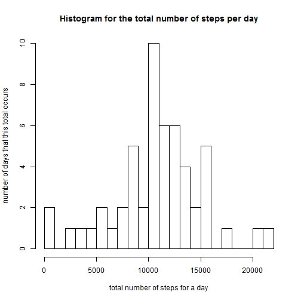
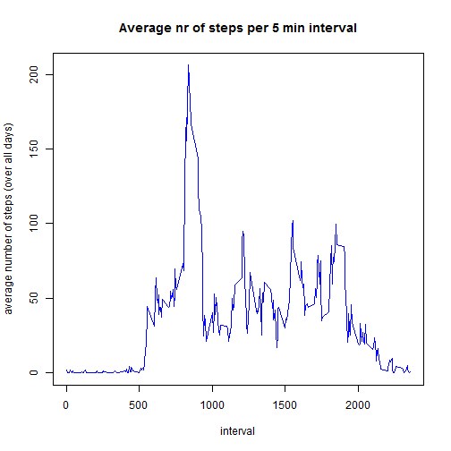
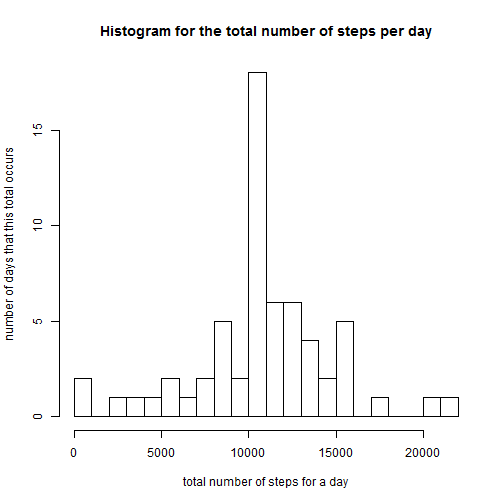
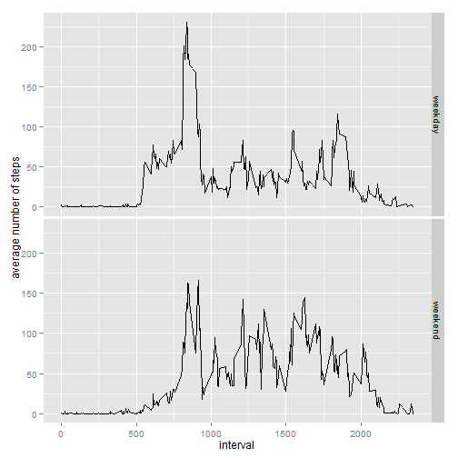

# Reproducible Research: Peer Assessment 1
## Loading and preprocessing the data

Since I use packages, I make sure these are loaded. Also note that I omit the NA values first. 


```r
require("reshape2")  
require("ggplot2")

#read in the data & remove NA values
data <- read.csv("activity.csv", stringsAsFactors=FALSE) 
complete_data <- na.omit(data)
```


## What is the mean total number of steps taken per day?

In order to answer this question, I have made use of melt() and dcast() provided by the reshape2 package, to compute the total nr of steps for each day. See the snippet below:


```r
#compute the total nr of steps for each day (using melt & dcast)
melt_data <- melt(complete_data, id="date", measure.vars = "steps")
res_data <- dcast(melt_data, date ~ variable, sum)
```

Note that 'res_data' refers to the resulting dataframe. Based on this dataframe, I created a histogram using
the number of steps as the variable:


```r
#create the histogram + add labels to improve readability
hist(res_data$steps, breaks = 20, main = "Histogram for the total number of steps per day", xlab= "total number of steps for a day", ylab="number of days that this total occurs")
```

 

In order to be better able to 'read' the histogram, I chose to have 20 'bars' (after some playing around), each representing a certain frequency group (per 1000 steps). Take, for example, the first bar on the left. This should be interpreted as: *"there are 2 days where the total number of steps is in the range 0-1000".*

Looking at the histogram, it can be seen that the majority of the days have a steps total between 10000-11000. It is likely that the mean and median will be between these values (10000-11000). A simple computation of these statistical values proves this:


```r
mean(res_data$steps)
```

```
## [1] 10766
```

```r
median(res_data$steps)
```

```
## [1] 10765
```

## What is the average daily activity pattern?

To create the time series plot, I followed a similar set of steps as with the previous question. I used melt() and dcast() to get the desired dataset:


```r
#compute the average nr of steps for each interval (using melt & dcast)
  molten_data <- melt(complete_data, id="interval", measure.vars = "steps")
  result_data <- dcast(molten_data, interval ~ variable, mean)
```

The plot can now be created. I used the base plotting system for this plot. I make use of the 'xaxt = n' parameter to add a customized x-axis, so that the number of 'ticks' displayed is reduced (and readability is improved):


```r
#create the plot, without x-axis
plot(result_data$interval, result_data$steps, type="l", col="blue", main = "Average nr of steps per 5 min interval", 
     xlab="interval", ylab="average number of steps (over all days)", xaxt="n")#xaxt="n" will prevent the x-axis from being filled

#add the x-axis with values that reduce the total number of ticks displayed (=better readability)
axis(side=1, at=c(0,500,1000,1500,2000,2500))
```

 

From this plot, one can derive the maximumvalue. If you look at the plot, this maximum value occurs somewhere between interval (+/-)800-1000. The code below shows how the exact value is computed:


```r
#derive the index at which the nr of steps is maximal
maximum_ind <- which.max(result_data$steps)

#what interval is this?
result_data[maximum_ind, 1]
```

```
## [1] 835
```


## Imputing missing values

In order to determine the total nr of rows with missing values, I used nrow() and complete.cases():


```r
#determine the total nr of rows with missing values 'NAs'
  missingrows <- nrow(data) - sum(complete.cases(data))
  missingrows
```

```
## [1] 2304
```

My chosen strategy to impute missing data was to use the already calculated mean values for each interval from the previous question and assign them to all the days where there are NA values for that interval.

I had to first copy the original data (i didn't want to affect the dataframe 'data') and after that I used a combination of merge(), within() and order() to obtain the 'correct_data' dataframe (correct referring to all dates are represented in the dataset):


```r
data2 <- data

#combine the result_data dataframe (with means for each interval over all days) and testdata
merged_data <- merge(data2, result_data, by.x = "interval", by.y = "interval")

#please take note of the names of the columns in this dataset(the other derived datasets also have these names)
names(merged_data)
```

```
## [1] "interval" "steps.x"  "date"     "steps.y"
```

```r
#order the merged dataset based on the date and interval column
ordered_data <- merged_data[order(merged_data[,3], merged_data[,1]),]

#now reassign the values for the step.x column: If it's value is not NA, keep the value, else, assign the step.y value
#the result is captured in the dataframe correct_data
correct_data <- within(ordered_data, steps.x <- ifelse(!is.na(steps.x), steps.x, steps.y))
```

Note that the creation of the histogram is analogous to question 1. I, once again, made use of melt() and dcast(). After that, I create the histogram:


```r
#compute the total nr of steps for each day (using melt & dcast)
mlt_data <- melt(correct_data, id="date", measure.vars = "steps.x")
desired_data <- dcast(mlt_data, date ~ variable, sum)

#create the histogram + add labels to improve readibility
hist(desired_data$steps.x, breaks = 20, main = "Histogram for the total number of steps per day", 
     xlab= "total number of steps for a day", ylab="number of days that this total occurs")
```

 

The mean and median computations are also analogous to question 1:


```r
#compute the mean and median for the dataset
mean(desired_data$steps.x)
```

```
## [1] 10766
```

```r
median(desired_data$steps.x)
```

```
## [1] 10766
```

These values do not differ much from question 1, but I am somewhat hesitant to believing that it's no problem to impute missing data. I feel like I got lucky with my strategy choice.

## Are there differences in activity patterns between weekdays and weekends?

For readability for others, I change the locale to US English:


```r
#set syslocale to English US
Sys.setlocale("LC_TIME","English_United States.1252")
```

In order to create and correctly fill the factor variable containing either 'weekday' or 'weekend', I created the following code:


```r
#change the type of 'date' column to the 'Date' type:
correct_data$date <- as.Date(correct_data$date, "%Y-%m-%d")

#create weekend/weekday variable and fill with values from weekdays()
correct_data$weekday_weekend <- weekdays(correct_data$date)

#now substitute Saturday&Sunday with 'weekend' and the rest to weekdays to 'weekday'
#afterwards, make the column a factor variable
correct_data$weekday_weekend <- gsub("Saturday|Sunday", "weekend", correct_data$weekday_weekend)
correct_data$weekday_weekend <- gsub("Monday|Tuesday|Wednesday|Thursday|Friday", "weekday", correct_data$weekday_weekend)
correct_data$weekday_weekend <- as.factor(correct_data$weekday_weekend)
```

Now that I have the factor variable, I can create the desired dataset (named r_data in my code), which has the average nr of steps per interval per type of day (weekday/weekend). I used melt() and dcast() for this:


```r
#compute the average nr of steps for each interval (using melt & dcast)
m_data <- melt(correct_data, id=c("interval","weekday_weekend"), measure.vars = "steps.x")
r_data <- dcast(m_data, interval + weekday_weekend ~ variable, mean)
```

With the desired dataset created, it is now possible to create the plot. I make use of the facets aspect in qplot() to split the plot in 2 plots: 1 for weekday and 1 for weekend:


```r
#create the desired plot and change y-axis description
p <- qplot(interval, steps.x, data = r_data, facets = weekday_weekend ~ ., geom="line")
p + labs(y = "average number of steps")
```

 

Looking at this plot, between intervals +/- 800 to 1000 on weekdays, there is more activity than in the weekend. Other than that, the weekend seems to trigger more activity.
